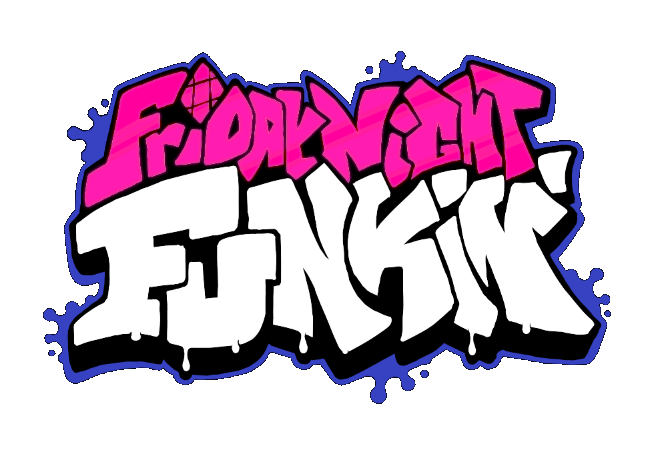

# Friday Night Funkin' COMPILER (BETA)

Hiiii

I guess you want to compile FNF ?
If not then uhh what are you doing here? Go watch this *awesome* video --> https://www.youtube.com/watch?v=dQw4w9WgXcQ

If yes then you are in the good place!

I know how it's messy to found every haxe librairies for different engines then i made a batch installer for it.

Supported engines :

Psych Engine

OS Engine

Kade Engine

Forever Engine

Izzy Engine

Note : You need a performant computer for compiling | with a old computer like mine it's 30min of compiling but basically it's 5-15 minutes.

------------------------------------------------------------------------------------
## Installation:
You just need to open installer.bat or .sh for MAC and follow installation steps!
* note : for mac and linux you should have [haxe](https://haxe.org/download/version/4.2.5/) and [git-scm](https://git-scm.com/downloads)

After that, if you want to compile the game go to art/ and open the batch files.
Or you can use a CMD command to enter command manually. (not in art folder, the default folder)

## Compile the game:
Step 1
Open CMD Prompt ( WINDOWS + R ) and enter CMD

Step 2
Go to windows explorer and copy source code localisation
Paste it in CMD prompt with "CD" suffix and press enter

Step 3
Now you need to use the correct command for compiling
* (example for build command):
 

## Lime commands:

The syntax is very important, the command should start with "lime" after that use "build" (or test) and -release (or -debug)
* (note : debug is optionnal)
* if you have an error like "lime is not a internal or external command", use "haxelib run lime setup" and ignore the update for HXCPP (press n and enter)
* You can use "haxelib run lime" instead of lime command prefix

If you want to make a release build use :

lime build windows -release

If you want to make a test build use :

lime test windows -debug
The command test is recommanded because the game gonna compile only edited files.

Now you can compile FNF source code!

note : if you got an error or if you want to compile another engine, make a issue here ! https://github.com/YouDevsYoupikmin/FNF-COMPILER/issues/
